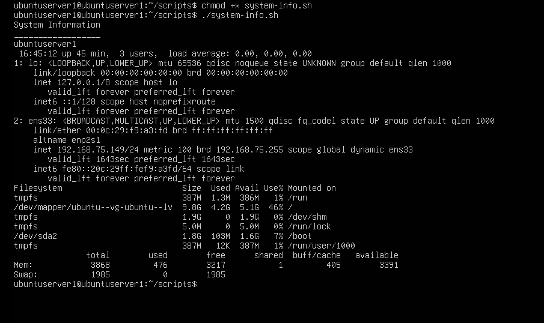

# Linux Home Lab

Personal Linux home lab built using VMware and Ubuntu Server to practice Linux system administration, networking, web server configuration, and troubleshooting.

---

# Project Goals

- Practice Linux administration
- Learn networking concepts
- Configure Linux services
- Improve troubleshooting skills

---

# Lab Architecture

VMware Workstation/ Ubuntu server VM / Apache2
                                     / OpenSSH
                                     / UFU Firewall
                  / client VM

---

# Technologies Used

- Ubuntu Server
- VMware
- Apache2
- OpenSSH
- Bash
- Linux Networking
- Git & GitHub

---

# Network Configuration

| Device | IP Address |
|---|---|
| Ubuntu Server | 192.168.75.149 |
| Client Machine | 192.168.75.150 |
| Gateway | 192.168.75.1 |

---

# Screenshots

## Ubuntu Server Terminal

## Apache Running

## System Info Script

---