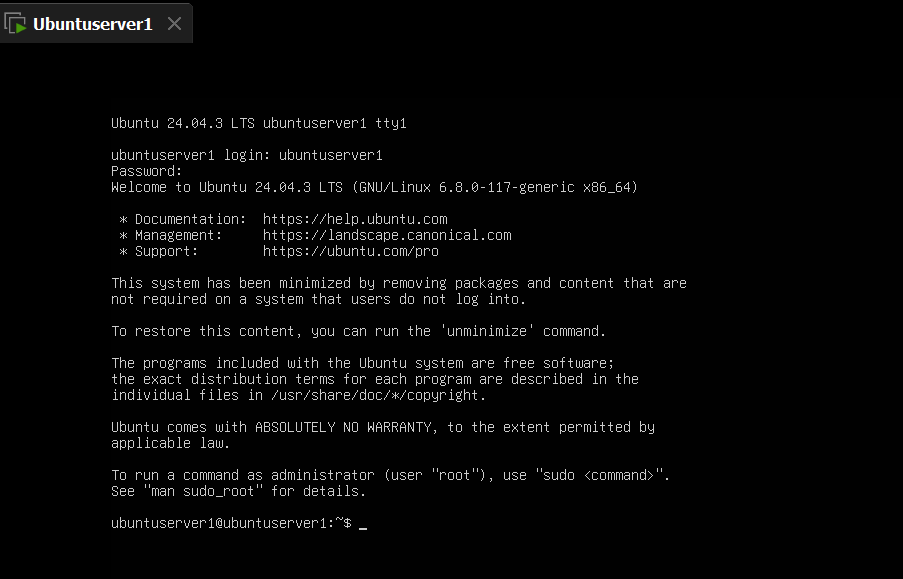
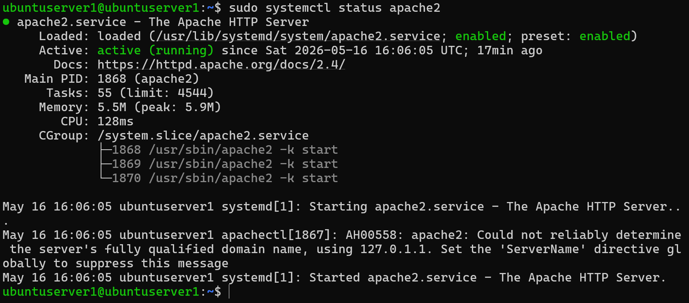

# Linux Home Lab

Personal Linux lab environment built using VMware and Ubuntu Server for system administration, networking, and server management practice.

---

# Technologies Used

- Ubuntu Server
- VMware Workstation
- Apache2
- SSH
- Linux Networking
- Bash

---

# Lab Features

- Linux server installation
- Static IP configuration
- Apache web server setup
- SSH remote access
- Basic network troubleshooting
- Service management with systemctl

---

# Project Structure

```text
configs/       -> configuration files
networking/    -> networking notes
services/      -> Linux services setup
screenshots/   -> lab screenshots
scripts/       -> automation scripts
```

---

# Screenshots

## Ubuntu Server



## Apache Running



---

# Skills Practiced

- Linux Administration
- Networking Basics
- Web Server Configuration
- SSH Management
- Troubleshooting
- Command Line Usage

